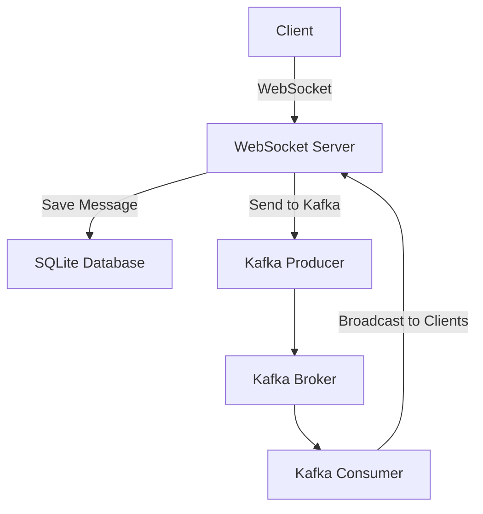
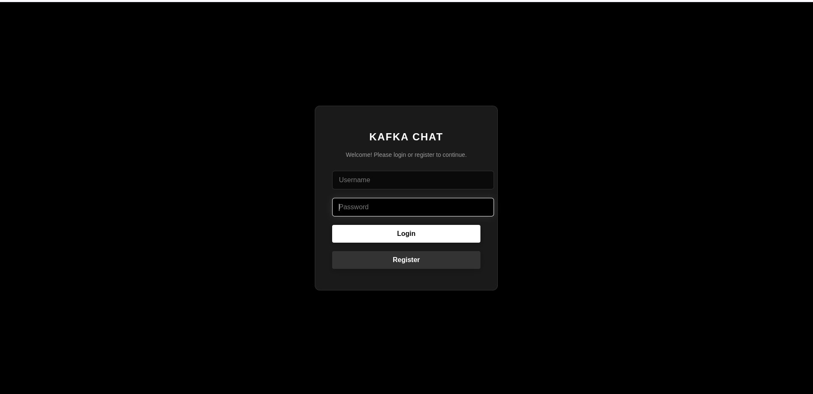
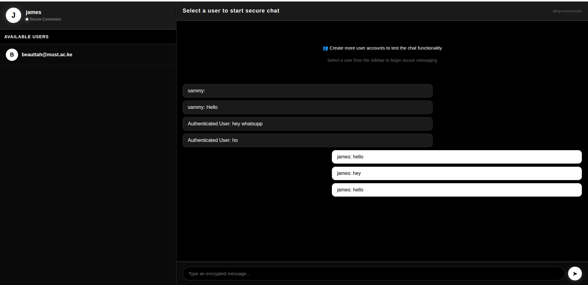

# Kafka Chat  

  _Easier way to test Kafka_

## Description
This is a Kafka-based chat application built with Node.js. It leverages WebSocket for real-time communication, Kafka for message broadcasting, and SQLite for persistent storage. The application also includes user authentication using bcrypt and JWT.

### Features
- Real-time messaging with WebSocket.
- Kafka integration for scalable message broadcasting.
- Database for storing messages and user data. - chose SQlite for local testing
- User authentication with bcrypt and JWT.
- Login and registration page for new users.
- frontend for client interaction.

## Workflow
The following Mermaid diagram illustrates the workflow of the Kafka Chat Application:



## Tools Needed
To run this application, you need the following tools:
- **Kafka**: A distributed event streaming platform. Install and configure Kafka on your system.
- **Node.js**: JavaScript runtime for running the application.
- **Database**: database for storing messages and user data. 

## Installation
1. Clone the repository:
   ```bash
   git clone https://github.com/kiprutobeauttah/Kafka-chat.git
   ```
2. Navigate to the project directory:
   ```bash
   cd kafka-chat
   ```
3. Install dependencies:
   ```bash
   npm install
   ```
4. Start the application:
   ```bash
   node server.js
   ```

## Auto-Run Scripts
To simplify starting the Kafka Chat Application, use the provided scripts in the `auto-run` folder:

### Windows
Run the `.bat` file:
```cmd
cd auto-run
run-kafka-chat.bat
```

### Linux/Mac
Run the `.sh` file:
```bash
cd auto-run
./run-kafka-chat.sh
```
Ensure the `.sh` file has executable permissions:
```bash
chmod +x auto-run/run-kafka-chat.sh
```

## Download Kafka
To download and extract Kafka, use the provided scripts in the `auto-run` folder:

#### Windows
Run the `.bat` file:
```cmd
cd auto-run
run.bat
```

#### Linux/Mac
Run the `.sh` file:
```bash
cd auto-run
./run.sh
```
Ensure the `.sh` file has executable permissions:
```bash
chmod +x auto-run/run.sh
```

## Screenshots
### Chat Interface



### Kafka Workflow


---
Ensure Kafka is running locally before starting the application. Refer to the Kafka documentation for setup instructions.